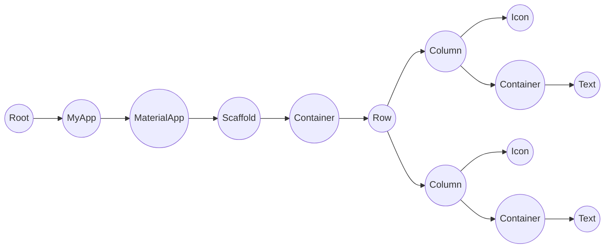

## Daftar Isi 
- [RunApp](#runapp) 
- [Widget](#widget) 
- [Struktur Umum](#struktur-umum) 
  -  [MaterialApp](#materialapp) 
  -  [Scaffold](#scaffold)
  -  [Widget Umum](#widget-umum)
  -  [Widget Layouting](#widget-layouting)
- [Shortcut](#shortcut) Penting!

## RunApp
> Dalam flutter harus menggunakan runapp karena flutter tidak bisa dijalankan seperti program dart biasa secara langsung
```dart
void main() {
  //runapp menerima sebuah parameter yaitu class yang akan dirun contohnya myapp (nama bisa dikustomisasikan)
  runApp(const MyApp());
}
```

## Widget

-   Widget adalah komponen yang saling terhubung untuk membentuk antarmuka (UI) di Flutter
- Dalam flutter terdapat suatu pohon yang digunakan untuk membangun suatu antarmuka (UI) yaitu pohon widget dimana semua widget harus memenuhi urutan ini secara sekuensial
### Contoh :
<h3  align="center">Pohon Widget</h3>



- Untuk buat widget kita tentu harus membuat class contohnya adalah myapp (sebagai root) (namanya juga boleh berubah) yang classnya akan di extends pada suatu statelesswidget/statefulwidget yang harus terlbeih dahulu mengimport suatu package yaitu material.dart 
```dart
import 'package:flutter/material.dart';
```
## Struktur Umum
 - Struktur umum dari suatu proyek flutter haruslah memenuhi aturan dari pohon widget dan harus sekuensial sifatnya (berurutan), berikut adalah struktur paling umum dari suatu proyek framework flutter (Namun beberapa struktur dapat berubah namun tetap harus sekuensial seperti MaterialApp yang bisa digantikan dengan CupertinoApp yang dispesialisasikan dalam pengembangan aplikasi platfrom ios)
 ### MaterialApp
 - MaterialApp adalah sebuah widget root yang digunakan untuk mengimplementasikan tema dan beberapa pengaturan lainnya
 Contoh :
```dart
class MyApp extends StatelessWidget {
  const MyApp({super.key});

  @override
  Widget build(BuildContext context) {
    return MaterialApp(
      debugShowCheckedModeBanner: false,
      home: Homepage(),
    );
  }
```
> Contoh pengonstruksian MaterialApp dalam flutter
 ### Scaffold
 - Pada MaterialApp terdapat atribut yaitu "home : " yang didalamnya terdapat Scaffold yang merupakan widget utama yang biasanya merupakan suatu kerangka visual dari suatu proyek yang diterapkan pada layar
```dart
 return MaterialApp(
        debugShowCheckedModeBanner: false,
        home: Scaffold()
 )
```
> Contoh pengonstruksian Scaffold dalam flutter
 ### Widget Umum
 - Terdapat beberapa widget umum yaitu
	 - Safearea
		 - Safearea adalah suatu widget yang sangat penting yang biasanya digunakan sebagai pembungkus seluruh widget yang ada pada layar sebagai widget parent utama, yang berfungsi sebagai pemberi padding secara otomatis agar tidak menyentuh bagian layar yang seharusnya tidak boleh disentuh, disisi lain safearea juga memudahkan dan mengoptimalkan aplikasi untuk bekerja pada platform yang berbeda karena menggunakan mediaQuery sebagai dasar paddingnya 
		 
	```dart
	 return MaterialApp(
	        debugShowCheckedModeBanner: false,
	        home: Scaffold(
		        body: SafeArea(
			        child : Widget()
			    )
			}
	 )
	```
	 - Text
		 - Text adalah suatu widget yang digunakan untuk merepresentasikan suatu text yang memiliki atrbut yang digunakan untuk mengatur tema dan pengaturan text lainnya 
	```dart
	 return MaterialApp(
	        debugShowCheckedModeBanner: false,
	        home: Scaffold(
		        body: Text()
		    )
	 )
	```
	 - Container
		 - Container adalah widget yang biasa digunakan sebagai pembungkus widget lainnya yang memiliki macam macam atribut yang bisa digunakan untuk mengkustomisasi penampilannya.
	```dart
		 return MaterialApp(
		        debugShowCheckedModeBanner: false,
		        home: Scaffold(
			        body: Container(
				        child : Widget()
				    )
				}
		 )
	```
	 - Icon
		 - Icon adalah widget yang biasa digunakan untuk merepresentasikan suatu icon/simbol yang dimana flutter sendiri menyediakan fitur bawaan icon pada frameworknya.
	```dart
	 return MaterialApp(
	        debugShowCheckedModeBanner: false,
	        home: Scaffold(
		        body: Icon()
		    )
	 )
	```
	 - Image
		 - Image adalah widget yang digunakan untuk merepresentasikan sebuah gambar, didalamnya terdapat atribut yang dapat menentukan gambar seperti asalnya, local/internet dan sebagainya
	```dart
	 return MaterialApp(
	        debugShowCheckedModeBanner: false,
	        home: Scaffold(
		        body: Image()
		    )
	 )
	```
	 - Button
		 - Button adalah widget yang digunakan sebagai tombol, yang fungsi untuk menjalankan suatu prosedur dengan interaksi yang dapat dikustomisasi.
	```dart
		 return MaterialApp(
		        debugShowCheckedModeBanner: false,
		        home: Scaffold(
			        body: ElevatedButton(
				        child : Widget()
				    )
				}
		 )
	```
 ### Widget Layouting
 - Terdapat tiga widget layouting dasar yaitu
	 - Column
		 - Column adalah widget layouting yang digunakan untuk mengatur urutan widget dengan main axis atas-bawah dan cross axis kanan-kiri, column memiliki children dalam bentuk list.
	```dart
		 return MaterialApp(
		        debugShowCheckedModeBanner: false,
		        home: Scaffold(
			        body: Column(
				        children : <Widget>[Widget(),Widget(),....]
				    )
				}
		 )
	```
	 - Row
		 - Row adalah widget layouting yang digunakan untuk mengatur urutan widget dengan main axis kanan-kiri dan cross axis atas-bawah, column memiliki children dalam bentuk list.
	```dart
		 return MaterialApp(
		        debugShowCheckedModeBanner: false,
		        home: Scaffold(
			        body: Row(
				        children : <Widget>[Widget(),Widget(),....]
				    )
				}
		 )
	```
	 - Stack
		 - Stack adalah widget layouting yang digunakan untuk memberi layer atau lapisan yang dapat menimpa suatu widget.
	```dart
		 return MaterialApp(
		        debugShowCheckedModeBanner: false,
		        home: Scaffold(
			        body: Stack(
				        children : <Widget>[Widget(),Widget(),....]
				    )
				}
		 )
	```

## Shortcut
- Membuat Template Stateless Widget
> - Ketik "stl" 
-	Mengakses menu refractor
> - Ctrl + .
- Melihat semua atribut pada widget yang digunakan
> - Ctrl + i
